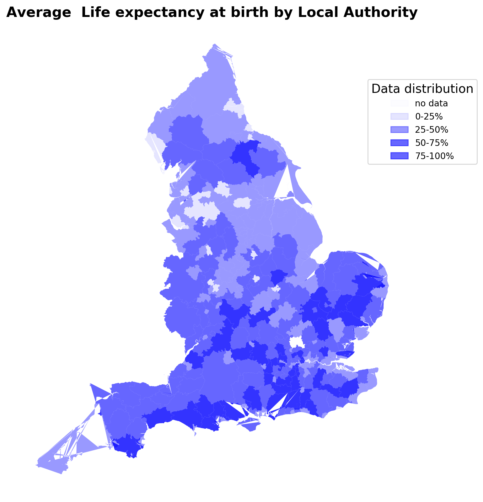

## mapping

#### [See code here](mapping_code.ipynb)

Experimenting with mapping from shapefiles + pandas dataframes. 

Life expectancy data used in this example is from the Office for National Statistics.  

If you have trouble rendering the notebook, please copy and paste the link into [nbviewer](https://nbviewer.jupyter.org/)

