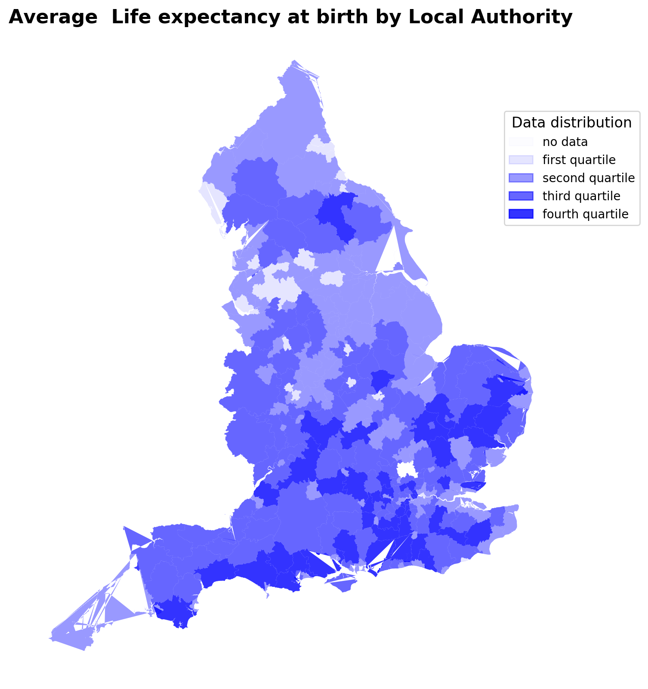

## mapping

#### [See code here](mapping_code.ipynb)

Experimenting with mapping from shapefiles + pandas dataframes - work in progress. 

Life expectancy data used in this example is available from the [Office for National Statistics](https://www.ons.gov.uk/).  

If you have trouble rendering the notebook, please copy and paste the link into [nbviewer](https://nbviewer.jupyter.org/)

